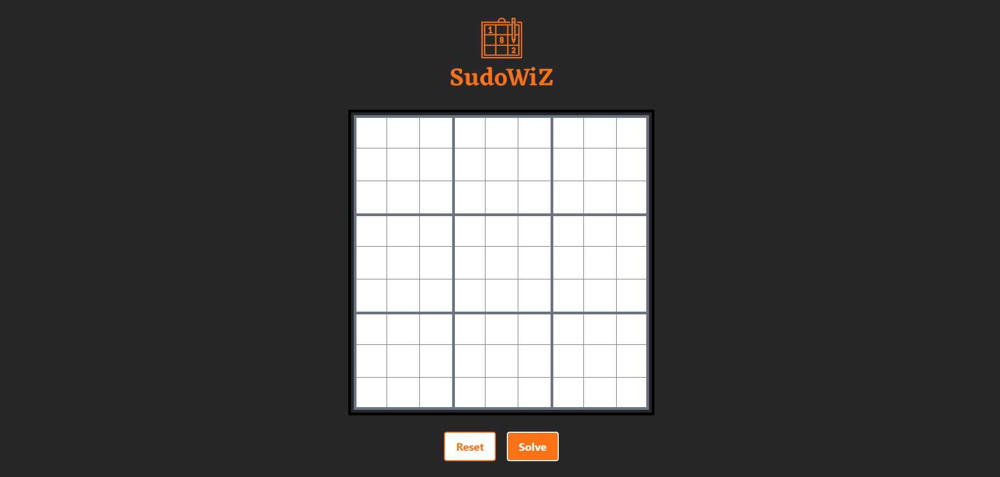
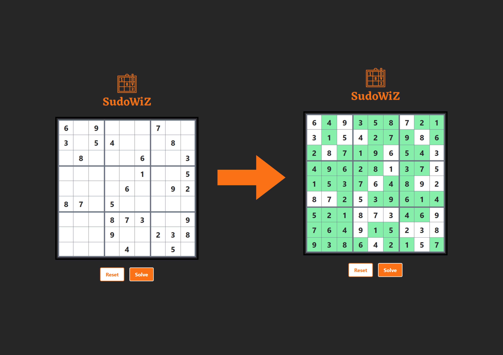

# SudoWiz

A web-based Sudoku solver built with React and Tailwind CSS. SudoWiz provides an interactive Sudoku grid where users can input numbers, solve the Sudoku puzzle, and reset the grid.

## Features

- **Interactive Sudoku Grid:** Enter numbers into the grid and validate your input.
- **Solve Functionality:** Automatically solves the Sudoku puzzle and highlights the solved cells.
- **Reset Functionality:** Clear the grid and start fresh.
- **Responsive Design:** Optimized for both desktop and mobile browsers.

## Screenshots

### Home Page

<div>
    
</div>

### Sudoku Solver

<div>
    
</div>

## Getting Started

### Prerequisites

Make sure you have [Node.js](https://nodejs.org/) and [npm](https://www.npmjs.com/) installed on your machine.

### Installation

1. Clone the repository:
   ```bash
   git clone https://github.com/yourusername/SudoWiz.git
   ```
2. Navigate into the project directory:
   ```bash
   cd SudoWiz
   ```
3. Install dependencies:
   ```bash
   npm install
   ```
4. Start the development server:
   ```bash
   npm run dev
   ```
5. Open your browser and navigate to http://localhost:3000 to see the app in action.
<br>
(Note : The port number may differ depending on your system and configuration.)

### Usage

1. Enter numbers into the Sudoku grid.
2. Click the "Solve" button to automatically solve the puzzle.
3. Click the "Reset" button to clear the grid and start over.

### Contributing

Contributions are welcome! Please fork the repository and submit a pull request with your changes.

## Acknowledgments

- **[React](https://reactjs.org/)** - JavaScript library for building user interfaces
- **[Tailwind CSS](https://tailwindcss.com/)** - Utility-first CSS framework
- **Backtracking Algorithm** - The algorithm used for solving Sudoku puzzles